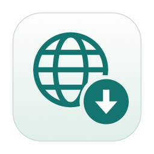
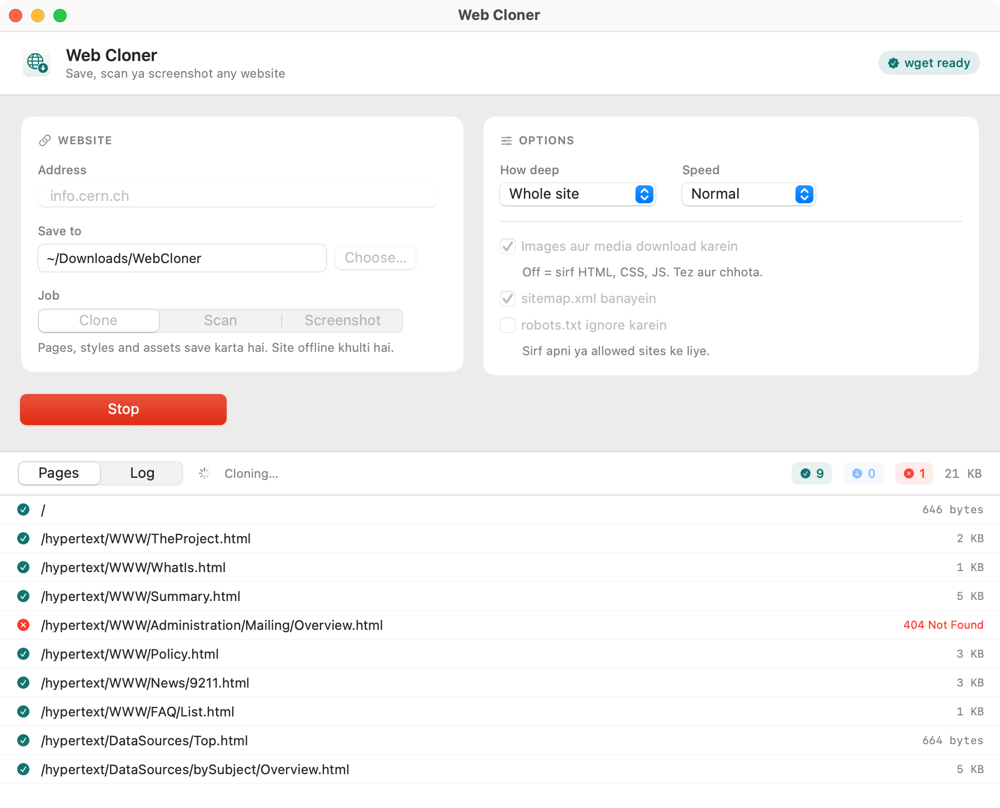

<div align="center">



# Web Cloner

**Free website downloader, site cloner and full-page screenshot tool for macOS.**

Download any website to your Mac, generate its sitemap, or capture a screenshot of every page — from one clean native app, without touching the Terminal.

[](https://github.com/DeveloperSarim/web-cloner-mac/releases/latest/download/WebCloner.dmg)

[](#requirements)
[](#requirements)
[](https://developer.apple.com/xcode/swiftui/)
[](LICENSE)
[](https://github.com/DeveloperSarim/web-cloner-mac/releases/latest)



</div>

---

## What is Web Cloner

Web Cloner is a **native macOS app** that puts a modern SwiftUI interface on top of battle-tested `wget`. Save a whole website for offline reading, scan a site to discover its pages, or capture a full-page PNG of every page. Each page appears in a live list with its own status, so you always know what finished and what is still running.

It is the friendly Mac alternative to HTTrack and to typing `wget --mirror` by hand.

## Features

| | |
|---|---|
| 🌐 **Clone website** | Downloads pages, CSS, JavaScript and images, converts links, and leaves you a site that browses offline |
| 🔍 **Scan only** | Discovers every page on a site without downloading anything |
| 📸 **Screenshots** | Full-page PNG of each page at 1280, 1440 or 1920 width |
| 🖼️ **CDN assets included** | Images, fonts and stylesheets served from another domain are downloaded too and relinked, so nothing loads from the internet |
| 🗺️ **Sitemap generator** | Writes a standard `sitemap.xml` after every job |
| 📊 **Live page list** | Downloading, Done, Failed and Redirect states with sizes and click-to-filter counters |
| ⚙️ **Automatic setup** | Installs `wget` for you through Homebrew if it is missing |
| 🚦 **Speed control** | Polite (rate limited), Normal or Fast, so you do not get blocked |
| 🧭 **Depth control** | Whole site, or only 1 to 5 levels deep |
| 🖥️ **Universal binary** | Runs natively on both Intel and Apple Silicon |

## Install

### 1. From the DMG (recommended)

1. **[Download WebCloner.dmg](https://github.com/DeveloperSarim/web-cloner-mac/releases/latest/download/WebCloner.dmg)**
2. Open the DMG and drag **Web Cloner** onto the **Applications** folder
3. Launch it. The first time macOS blocks it, use **right-click → Open → Open**

### 2. wget

The app needs `wget`. If it is missing, a **Setup** card appears:

- Homebrew installed → press **Install wget** and the app runs `brew install wget` in the background
- No Homebrew → the same button opens Terminal and installs Homebrew and wget (enter your Mac password there)

To do it yourself:

```bash
brew install wget
```

### 3. Build from source (optional)

```bash
git clone https://github.com/DeveloperSarim/web-cloner-mac.git
cd web-cloner-mac
./build.sh          # produces WebCloner.app and WebCloner.dmg
```

Only the Xcode Command Line Tools are required (`xcode-select --install`). Full Xcode is not needed.

## How to use

1. Type the site into **Address**, either `example.com` or a full URL
2. Pick a folder under **Save to**
3. Choose a **Job**: Clone, Scan or Screenshot
4. Press **Start** and watch the pages arrive below
5. When it finishes, press **Open Folder** or **Open Website**

### Options

| Option | What it does |
|---|---|
| **How deep** | The whole site, or only 1, 2, 3 or 5 levels in |
| **Speed** | `Polite` adds a wait and a rate limit, `Fast` never pauses |
| **Width** | Screenshot width: 1280, 1440 or 1920 px |
| **Download images and media** | Turn off for HTML, CSS and JS only, which is far faster and smaller |
| **Create sitemap.xml** | Writes the sitemap into your save folder |
| **Ignore robots.txt** | Only for sites you own or are allowed to copy |

### Where the files go

```
<save folder>/
├── example.com/          # the cloned site, open index.html
│   └── index.html
├── screenshots/          # PNGs from the Screenshot job
└── sitemap.xml           # every page discovered
```

## Requirements

- macOS 13 Ventura or newer
- Intel or Apple Silicon Mac (universal binary)
- `wget` (the app can install it for you)

## FAQ

<details>
<summary><strong>How do I download an entire website on a Mac?</strong></summary>

Open Web Cloner, type the address, choose **Clone** and press **Start Cloning**. The app mirrors the site with `wget` and rewrites the links, so `index.html` works without an internet connection.
</details>

<details>
<summary><strong>Is this an HTTrack alternative?</strong></summary>

Yes. Same job, website mirroring, but with a native macOS interface, a live page list, a sitemap generator and built-in screenshots.
</details>

<details>
<summary><strong>The site keeps its images on a CDN. Will they download?</strong></summary>

Yes. Plain `wget` mirrors a single host, so anything on a CDN (Webflow, Shopify, WordPress with an asset domain) is skipped. After the mirror, Web Cloner reads the saved pages, collects every asset still pointing somewhere else, downloads it and rewrites the reference to the local copy. That includes URLs written as `url(&quot;https://cdn/image.jpg&quot;)`, which `wget` itself misreads and turns into 404s.
</details>

<details>
<summary><strong>Does it work on JavaScript-heavy sites?</strong></summary>

`wget` does not run JavaScript, so a fully client-rendered site gives you only its shell. Use the **Screenshot** job for those, because it renders in a real browser engine (WebKit).
</details>

<details>
<summary><strong>How large are the screenshots?</strong></summary>

Full-page PNGs at the width you choose (1280, 1440 or 1920) and the full height of the page. One job captures up to 60 pages.
</details>

<details>
<summary><strong>Is the app signed and safe?</strong></summary>

It is ad-hoc signed but not notarized by Apple, which is why the first launch needs **right-click → Open**. The entire source is in this repository, so you can build it yourself.
</details>

## Development

```
Sources/Engine.swift     # wget arguments, output parsing, sitemap, screenshots
Sources/UI.swift         # SwiftUI interface
Sources/makeicon.swift   # app icon generator
Tests/engine/main.swift  # parsing and sitemap checks
Tests/shot/main.swift    # real screenshot check
build.sh                 # universal build and DMG
```

Run the tests:

```bash
swiftc Sources/Engine.swift Tests/engine/main.swift -o /tmp/t && /tmp/t
swiftc Sources/Engine.swift Tests/shot/main.swift  -o /tmp/s && /tmp/s
```

## Contributing

Issues and pull requests are welcome. Please open an issue first for anything large.

## License

[MIT](LICENSE) — © 2026 Sarim Yaseen

## Author

**Sarim Yaseen** — [@DeveloperSarim](https://github.com/DeveloperSarim)

<div align="center">
<sub>If this app saved you time, a ⭐ on the repo helps.</sub>
</div>
